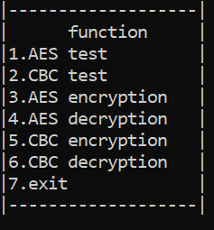
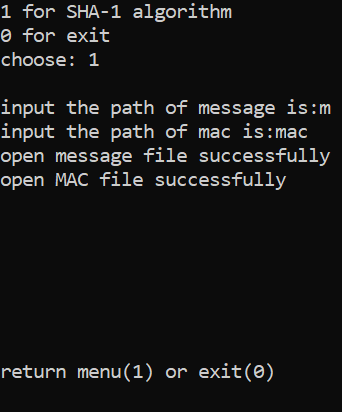
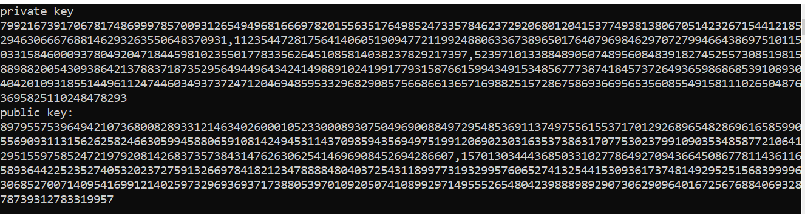

# 现代密码学课程设计

--- 

<!-- vscode-markdown-toc -->
* 1. [AES算法实现](#AES)
* 2. [CBC模式实现](#CBC)
* 3. [SHA-1算法](#SHA-1)
* 4. [RSA加密解密](#RSA)

<!-- vscode-markdown-toc-config
	numbering=true
	autoSave=true
	/vscode-markdown-toc-config -->
<!-- /vscode-markdown-toc -->

---

####  1. AES算法实现

1. 算法中的变量：
   
   * state是算法中执行操作的二维数组。该数组有四行，Nb列
   
   * Key是一个16bytes的字符串。最初的密钥是128位的种子密钥，由种子密钥生成共Nr+1轮子密钥，每一轮子密钥也是16bytes，用于和state中的每个分量进行异或运算。

2. 程序结构：
   
   | 文件名      | 功能                  |
   | -------- | ------------------- |
   | F256.h   | 声明域$F_{2^8}$ 接口的头文件 |
   | AES.h    | 声明AES操作接口的头文件       |
   | const.h  | 声明全局常数的头文件          |
   | F256.cpp | 实现域$F_{2^8}$ 上的相关操作 |
   | AES.cpp  | 实现AES加密的各项步骤        |
   | main.cpp | 测试主程序               |

3. 运行效果
   
   

4. 测试数据
   
   > message: 32 43 f6 a8 88 5a 30 8d 31 31 98 a2 e0 37 07 34
   > 
   > cipher key: 2b 7e 15 16 28 ae d2 a6 ab f7 15 88 09 cf 4f 3c

使用AES test进行测试，将message和cipher key分别写入文件 `fm.txt`  和 `fk.txt`  最终将加密结果输出到文件 `code_ch.txt`   和`code_hex.txt` 中

可以和`AES标准fips-197[1].PDF.pdf` 中测试数据进行对比。

####  2. CBC模式实现

在AES代码上添加功能即可

1. 程序结构
   
   | 文件名      | 功能                  |
   | -------- | ------------------- |
   | F256.h   | 声明域$F_{2^8}$ 接口的头文件 |
   | AES.h    | 声明AES操作接口的头文件       |
   | const.h  | 声明全局常数的头文件          |
   | CBC.h    | CBC模式加解密的接口         |
   | F256.cpp | 实现域$F_{2^8}$ 上的相关操作 |
   | AES.cpp  | 实现AES加密的各项步骤        |
   | CBC.cpp  | 实现CBC加解密的操作         |
   | main.cpp | 测试主程序               |

2. 运行效果

        

        其中后面四项功能是对ascii文件进行加密解密的

####  3. SHA-1算法

1. 涉及到的数据结构：

        `string`,`stl::bitset`,`stl::vector`

2. 程序结构
   
   | 文件名      | 功能                   |
   | -------- | -------------------- |
   | SHA.h    | 声明SHA算法的接口           |
   | util.h   | 声明通用的库和数据结构，以及调试的宏定义 |
   | SHA.cpp  | 定义SHA算法相关操作          |
   | main.cpp | 测试主程序                |

3. 运行效果
   
   
   
   当两个路径输入分别为`m`和`mac` 时，相当于输入默认路径，默认路径可以再代码中修改。

4. 测试数据
   
   可以用ppt上的测试数据，也可以用自己构造的数据，然后和在线编码网站的结果比对[在线加密解密 (oschina.net)](https://tool.oschina.net/encrypt?type=2)

5. 一些细节
   
   由于存储$2^{64}-1$ 长度的比特串不现实，因此我采用的是分组读取。但是分组读取需要考虑串的长度$l$ ，并讨论。
   
   * 如果$l=512$ ，那直接得到他的二进制串即可
   
   * 如果$l\lt 447$ ，那么直接生成一组512的$M_i$ 
   
   * 如果$447\leq l\lt512$ ，则需要生成两组
   
   除此以外，分组读取的时候要累加每一组的长度，最后连接的长度二进制串不是本次读取的长度，而是总长度！

####  4. RSA加密解密

1. NTL库
- 官方文档：https://libntl.org/doc/tour-ex1.html
- NTL/ZZ库使用：https://github.com/libntl/ntl/blob/main/doc/ZZ.txt
- 配置说明：https://blog.csdn.net/zfy1996/article/details/106701765?spm=1001.2101.3001.6650.12&utm_medium=distribute.pc_relevant.none-task-blog-2%7Edefault%7EBlogCommendFromBaidu%7ERate-12-106701765-blog-117782324.pc_relevant_antiscanv3&depth_1-utm_source=distribute.pc_relevant.none-task-blog-2%7Edefault%7EBlogCommendFromBaidu%7ERate-12-106701765-blog-117782324.pc_relevant_antiscanv3&utm_relevant_index=15

2. 程序结构
   
   | 文件名      | 功能                   |
   | -------- | -------------------- |
   | RSA.h    | RSA加密解密的接口           |
   | RSA.cpp  | RSA加密解密算法的实现        |
   | main.cpp | 测试主程序                |

3. 运行效果
   
   显示的是生成的密钥和公钥
   
   